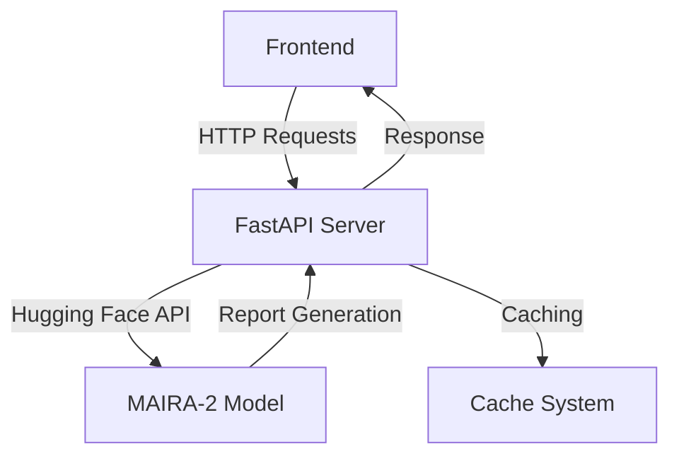

<div align="center">

# MAIRA-2 Radiology Report Generator

**A Research Implementation for Radiology Report Generation**  
*Backend (FastAPI) + Frontend (React)*  

[](https://opensource.org/licenses/MIT)
[](https://huggingface.co/microsoft/maira-2)

</div>

---

## 🚨 Important Notice  
**This is a research implementation.**  
MAIRA-2 is **not approved for clinical use** and should only be used for:
- Research benchmarking 🧪  
- Academic exploration 🎓  
- Technical validation of methods ⚙️  

---

## 📖 Table of Contents
- [Overview](#-overview)
- [Key Features](#-key-features)
- [Architecture](#-architecture)
- [Getting Started](#-getting-started)
  - [Prerequisites](#prerequisites)
  - [Installation](#installation)
- [Usage Guide](#-usage-guide)
- [Limitations](#-limitations)
- [Ethical Considerations](#-ethical-considerations)
- [References](#-references)
- [License](#-license)

---

## 🌐 Overview
This repository provides a full-stack implementation of Microsoft's [MAIRA-2](https://huggingface.co/microsoft/maira-2) model for generating radiology reports from chest X-rays. The system includes:

- **AI Backend**: FastAPI server handling model inference
- **Web Interface**: React-based frontend for user interaction
- **Caching System**: Optimized report generation pipeline

---

## ✨ Key Features
| Capability | Description |
|------------|-------------|
| Multi-View Analysis | Supports frontal + lateral X-rays + prior studies |
| Grounded Reporting | Generates findings with bounding box annotations |
| Flexible Inputs | Accepts clinical indications and comparison notes |
| Research Ready | Built-in metrics and caching for experimentation |

---

## 🏗 Architecture


**Model Components**:
- **Vision Encoder**: RAD-DINO-MAIRA-2 (frozen)
- **Projector**: Trained from scratch
- **LLM**: Fine-tuned Vicuna-7B-v1.5

---

## � Getting Started

### Prerequisites
- Node.js ≥16 + npm
- Docker + Docker Compose
- Hugging Face API Token ([Get Yours](https://huggingface.co/settings/tokens))
- 8GB+ free RAM (16GB recommended)

### Installation
1. **Clone Repository**
   ```bash
   git clone https://github.com/mvdiogoce/maira2-implementation.git
   cd maira2-implementation
   ```

2. **Configure the Environment**  
   Create a `.env` file in the project root with the following content:
   ```ini
   # Backend Configuration
   HF_TOKEN=your_huggingface_token
   NUM_THREADS=4
   ```

   Create a `.env` file in the project back folder with the following content:
   ```ini
   # Backend Configuration
   HF_TOKEN=your_huggingface_token
   NUM_THREADS=4
   ```

      Create a `.env.production` file in the project front.MAIRA-2 folder with the following content:
   ```ini
   # Frontend Configuration
   VITE_API_ENDPOINT=https://your-production-api.com/generate_report/
   ```
3. **Build & Launch**
   ```bash
   # Install frontend dependencies
   cd frontend && npm install && npm run build

   # Define your HF_TOKEN

   export HF_TOKEN='YOURKEY'

   # Start services on the root project
   docker compose up -d --build

   # Monitor initialization
   docker logs maira_backend -f
   ```

**Access Interfaces**:
- Frontend: http://localhost:8090
- API Docs: http://localhost:8000/docs

---

## 🖥 Usage Guide
**Basic Workflow**:
1. Upload chest X-ray (PNG/JPG/DICOM)
2. Add optional clinical context
3. Select report type (grounded/non-grounded)
4. Generate & visualize report

**Example API Call**:
```bash
curl -X POST "http://localhost:8000/generate_report/" \
  -F "frontal_url=https://openi.nlm.nih.gov/imgs/512/145/145/CXR145_IM-0290-1001.png" \
  -F "lateral_url=https://openi.nlm.nih.gov/imgs/512/145/145/CXR145_IM-0290-2001.png" \
  -F "indication=Shortness of breath" \
  -F "comparison=Previous study" \
  -F "technique=Standard PA and lateral views"
```

---

## ⚠️ Limitations
- **Clinical Use Prohibited** - Not validated for patient care
- **Demographic Bias** - Trained on Western population data
- **Modality Restriction** - Optimized for chest X-rays only
- **Language Constraint** - English reports only

**Environmental Impact** (Training):
- Hardware: 8× NVIDIA A100
- Duration: 1,432 GPU-hours
- CO₂ Emissions: ~107.4 kg (cloud-offset)

---

## 🧭 Ethical Considerations
- Intentionally designed **without** patient data retention
- Includes bias mitigation layers in preprocessing
- Strict input validation for data anonymization
- Regular security audits of the API endpoints

---

## 📚 References
1. [MAIRA-2 Model Card](https://huggingface.co/microsoft/maira-2)
2. Original Paper:  
   ```bibtex
   @article{Bannur2024MAIRA2,
     title={MAIRA-2: Grounded Radiology Report Generation},
     author={Bannur, Shruthi et al.},
     journal={arXiv:2406.04449},
     year={2024}
   }
   ```

---

## 📜 License
- **Model Weights**: [Microsoft Research License](https://aka.ms/maira-license)
- **Codebase**: MIT License (see [LICENSE](LICENSE))

---

<div align="center">
  <br>
  <p>Made with ❤️ by mvdiogo</p>
</div>

